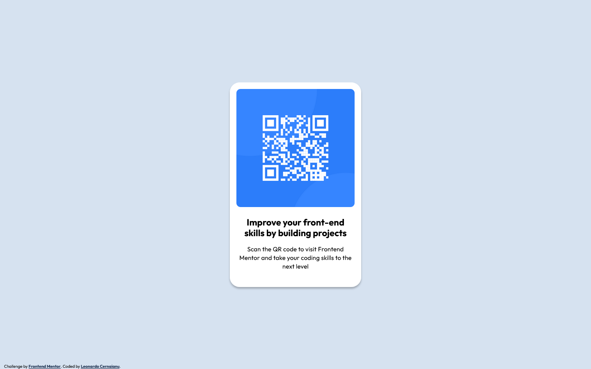

# Frontend Mentor - QR code component solution

This is a solution to the [QR code component challenge on Frontend Mentor](https://www.frontendmentor.io/challenges/qr-code-component-iux_sIO_H). Frontend Mentor challenges help you improve your coding skills by building realistic projects. 

## Table of contents

- [Overview](#overview)
  - [Screenshot](#screenshot)
  - [Links](#links)
- [My process](#my-process)
  - [Built with](#built-with)
  - [What I learned](#what-i-learned)
- [Author](#author)

**Note: Delete this note and update the table of contents based on what sections you keep.**

## Overview

### Screenshot




### Links

- Solution URL: [https://github.com/Leonardo76/qr-code-component-main.git](https://github.com/Leonardo76/qr-code-component-main.git)
- Live Site URL: [https://qrcodechallengefm.netlify.app](https://qrcodechallengefm.netlify.app)

## My process

### Built with

- Semantic HTML5 markup
- CSS custom properties
- Flexbox
- Mobile-first workflow
- SCSS

### What I learned

Useful class to hide an element. Used in the project for h1 to preserve the normal flow of the document:
- we cannot have an image before a h1 so:
- we have to use h2 for the title
- we must insert a hidden h1 before image

```scss
.visually-hidden {
  position: absolute;
  left: -10000px;
  top: auto;
  width: 1px;
  height: 1px;
  overflow: hidden;
}
```

Center an element in viewport.
```scss
.element {
  position: absolute;
  left: 50%;
  top: 50%;
  transform: translate(-50%, -50%);
}
```
## Author

- Frontend Mentor - [@Leonardo76](https://www.frontendmentor.io/profile/Leonardo76)